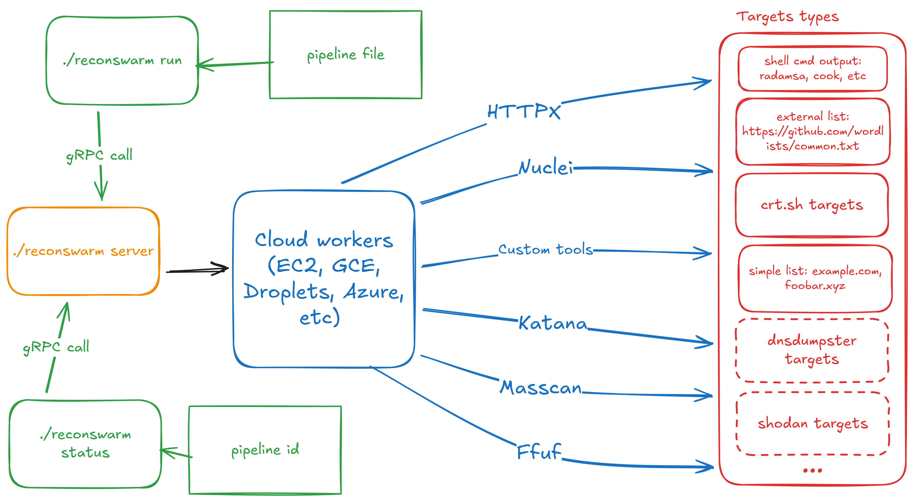

# ReconSwarm



ReconSwarm is a modular reconnaissance automation framework designed for distributed security testing. It provisions cloud infrastructure, executes parallel reconnaissance pipelines, and collects results with minimal configuration overhead.

ReconSwarm is suitable for bug bounty hunters, penetration testers, DevSecOps engineers, and security researchers who need scalable, automated reconnaissance workflows without manual infrastructure management.

## Features

- **Cloud-agnostic architecture** — Provisioner interface with discriminated union pattern allows easy integration with multiple cloud providers (currently Yandex Cloud)
- **Flexible pipeline stages** — Extensible stage system supporting exec (command execution) and sync (file and directory synchronization) operations
- **Parallel execution** — Distributes reconnaissance tasks across multiple worker VMs with configurable concurrency
- **Automatic lifecycle management** — VM provisioning, setup, execution, and cleanup handled automatically
- **Template-based configuration** — Go templates for dynamic command and path generation
- **Multiple target types** — Support for crt.sh enumeration and manual target lists
- **Stateless server** — Server stores no local state; all data persisted in etcd for fault tolerance
- **Horizontal scalability** — Run multiple server instances behind a load balancer
- **gRPC API** — Server mode with gRPC interface for pipeline submission and status monitoring
- **Config-driven** — All server settings configured via YAML file with environment variable support

## Architecture

ReconSwarm follows a modular architecture with clear separation of concerns between cloud provisioning, remote system control, pipeline execution, and configuration management.

### Cloud Provider Abstraction

ReconSwarm uses a **discriminated union pattern** for cloud provisioners. The `provisioner.type` field determines which provider configuration is active:

```yaml
provisioner:
  type: yandex_cloud  # Discriminator field
  yandex_cloud:       # Active when type: yandex_cloud
    iam_token: "${YC_TOKEN}"
    folder_id: "${YC_FOLDER_ID}"
    # ... provider-specific settings
```

Additional cloud providers can be integrated by implementing the `Provisioner` interface and adding a new type to the factory.

### Pipeline Stage System

Stages are extensible components that execute operations on worker VMs:

- **exec** — Execute shell commands with template support
- **sync** — Copy files or directories from remote VMs to local machine via SFTP (automatically detects file vs directory)

All stage fields support template rendering. New stage types can be added to extend functionality.

### Stateless Server & Fault Tolerance

ReconSwarm server is **completely stateless** — all state is persisted in etcd:

- **Pipeline state** — Status, progress, errors for each pipeline
- **Worker state** — VM info, current task, status
- **SSH keys** — Generated key pairs for VM access

This architecture enables:

| Capability | Description |
|------------|-------------|
| **Horizontal scaling** | Run multiple server instances behind a load balancer |
| **Zero-downtime restarts** | Restart server without losing pipeline state |
| **Crash recovery** | New server instance picks up where the previous one left off |
| **State inspection** | Query etcd directly for debugging and monitoring |

**High Availability Setup:**

```
                    ┌─────────────┐
                    │   Client    │
                    └──────┬──────┘
                           │
                    ┌──────▼──────┐
                    │Load Balancer│
                    └──────┬──────┘
              ┌────────────┼────────────┐
              │            │            │
       ┌──────▼──────┐ ┌───▼───┐ ┌──────▼──────┐
       │  Server 1   │ │Server2│ │  Server 3   │
       └──────┬──────┘ └───┬───┘ └──────┬──────┘
              │            │            │
              └────────────┼────────────┘
                           │
                    ┌──────▼──────┐
                    │ etcd cluster│
                    └─────────────┘
```

All servers share the same etcd cluster and can handle any request. If a server crashes mid-pipeline, another server can continue execution after reading state from etcd.

**Note:** Current implementation executes pipelines in-memory after loading from etcd. Full crash recovery with pipeline resumption is planned for future releases.

## Installation

```bash
git clone <repository>
cd reconswarm
go mod download
task build
```

## Configuration

ReconSwarm separates **server configuration** from **pipeline configuration**:

| Config Type | File | Description |
|-------------|------|-------------|
| Server | `reconswarm.yaml` | Cloud provider, etcd, worker pool settings |
| Pipeline | Separate YAML file | Targets and stages, passed via `-f` flag |

### Server Configuration

Server configuration is stored in `reconswarm.yaml` (configurable via `CONFIG_PATH` environment variable). All string values support environment variable expansion using `${VAR}` or `$VAR` syntax.

```yaml
# Server settings
server:
  port: 50051

# Etcd connection for state management
etcd:
  endpoints:
    - "localhost:2379"
  dial_timeout: 5  # seconds
  username: ""     # optional, supports ${ETCD_USER}
  password: ""     # optional, supports ${ETCD_PASSWORD}

# Cloud provisioner (discriminated union)
provisioner:
  type: yandex_cloud  # Provider selector

  # Yandex Cloud configuration (active when type: yandex_cloud)
  yandex_cloud:
    iam_token: "${YC_TOKEN}"
    folder_id: "${YC_FOLDER_ID}"
    default_zone: "ru-central1-b"
    default_image: "fd8b1cmhmncn7lt4tqn4"
    default_username: "root"
    default_cores: 2
    default_memory: 2      # GB
    default_disk_size: 20  # GB

# Worker pool settings
workers:
  max_workers: 5
  setup_commands:
    - "apt update"
    - "apt install -y docker.io"
```

### Pipeline Configuration

Pipeline configuration is stored in a separate YAML file and passed via the `-f` flag. Both wrapped and unwrapped formats are supported:

**Wrapped format** (recommended):
```yaml
# pipeline.yaml
pipeline:
  targets:
    - value: "example.com"
      type: crtsh
    - value: ["sub1.example.com", "sub2.example.com"]
      type: list
  stages:
    - name: "Run scanner"
      type: exec
      steps:
        - "nmap -sC -sV -iL {{.Targets.filepath}} -oN /opt/recon/scan.txt"
    - name: "Collect results"
      type: sync
      src: "/opt/recon/scan.txt"
      dest: "./results/{{.Worker.Name}}.txt"
```

**Unwrapped format** (also supported):
```yaml
# pipeline.yaml
targets:
  - value: "example.com"
    type: crtsh
stages:
  - name: "Run scanner"
    type: exec
    steps:
      - "nmap -iL {{.Targets.filepath}} -oN /opt/recon/scan.txt"
```

### Environment Variables

Configuration values support environment variable substitution in two formats:
- `${VAR}` — Full variable name in braces
- `$VAR` — Simple variable name

If an environment variable is not set, the literal string (including `${VAR}` or `$VAR`) will be used.

### Yandex Cloud Setup

For Yandex Cloud integration, use the provided setup script:

1. **Install Yandex Cloud CLI** (if not already installed):
   ```bash
   # Follow official Yandex Cloud documentation for CLI installation
   ```

2. **Configure Yandex Cloud CLI**:
   ```bash
   yc config profile create <profile-name>
   yc config set cloud-id <your-cloud-id>
   yc config set folder-id <your-folder-id>
   ```

3. **Export credentials**:
   ```bash
   source ./secrets-setup.sh
   ```
   
   This script exports:
   - `YC_TOKEN` — IAM token for authentication
   - `YC_FOLDER_ID` — Folder ID for resource management
   - `YC_CLOUD_ID` — Cloud ID (if needed)

4. **Reference in configuration**:
   ```yaml
   provisioner:
     type: yandex_cloud
     yandex_cloud:
       iam_token: "${YC_TOKEN}"
       folder_id: "${YC_FOLDER_ID}"
   ```

The `secrets-setup.sh` script automatically generates a fresh IAM token each time it's executed, ensuring secure authentication without hardcoding credentials.

### Target Types

**crt.sh enumeration**:
```yaml
targets:
  - value: "example.com"
    type: crtsh
```

**Manual list**:
```yaml
targets:
  - value: ["sub1.example.com", "sub2.example.com"]
    type: list
```

### Stage Configuration

All stage configuration fields support Go template syntax for dynamic value generation. Template variables are rendered at execution time with context data provided automatically.

**Template Context**

The following data is available in all stage templates:

| Variable | Description |
|----------|-------------|
| `{{.Targets.filepath}}` | Absolute path to the targets file on the remote VM |
| `{{.Targets.list}}` | Array of target strings for programmatic access |
| `{{.Worker.Name}}` | Unique identifier of the worker VM instance |

**Exec stage** — Executes shell commands with template support:
```yaml
stages:
  - name: "Run tool"
    type: exec
    steps:
      - "docker run --rm -v /opt/recon:/data scanner:latest {{.Targets.filepath}}"
      - "cat /opt/recon/results.json"
```

All commands in the `steps` array are template-rendered before execution.

**Sync stage** — Copies files or directories from remote to local using SFTP. Automatically detects whether the path is a file or directory:
```yaml
stages:
  - name: "Collect results"
    type: sync
    src: "/opt/recon/results.json"
    dest: "./results/{{.Worker.Name}}.json"
  
  # Sync entire directory recursively
  - name: "Collect all results"
    type: sync
    src: "/opt/recon"
    dest: "./results/{{.Worker.Name}}"
```

Both `src` (remote path) and `dest` (local path) support template rendering for dynamic file paths. The sync stage automatically detects whether the source path is a file or directory and handles it accordingly.

## Usage

### Server Mode

Start the gRPC server to accept pipeline submissions:

```bash
reconswarm server
```

The server reads configuration from `reconswarm.yaml` and listens on the configured port (default: 50051).

### Submit Pipeline via gRPC

Submit a pipeline to a running server:

```bash
reconswarm run -f examples/pipelines/nuclei.yaml
```

Options:
- `-f, --pipeline` — Path to pipeline YAML file (required)
- `-s, --server` — Server address (default: `localhost:50051`)

### Check Pipeline Status

```bash
reconswarm status <pipeline-id>
```

### Manual Pipeline Execution

Execute a pipeline directly without the gRPC server (useful for testing):

```bash
reconswarm manual -f examples/pipelines/nuclei.yaml
```

This command:
1. Reads server configuration from `reconswarm.yaml`
2. Prepares targets (enumerates subdomains via crt.sh if needed)
3. Creates worker VMs based on `workers.max_workers` configuration
4. Distributes targets across workers
5. Executes setup commands on each VM
6. Runs pipeline stages sequentially
7. Collects results via sync stages
8. Automatically deallocates all infrastructure after completion

The automatic infrastructure deallocation ensures complete autonomy — all cloud resources are provisioned, used, and destroyed without manual intervention, enabling fully automated reconnaissance workflows.

### Example Configurations

For complete pipeline examples, see the [`examples/pipelines`](examples/pipelines) directory.

**Basic subdomain enumeration and scanning**:
```yaml
# pipeline.yaml
pipeline:
  targets:
    - value: "example.com"
      type: crtsh
  stages:
    - name: "Scan targets"
      type: exec
      steps:
        - "nmap -sC -sV -iL {{.Targets.filepath}} -oN /opt/recon/nmap-{{.Worker.Name}}.txt"
    - name: "Collect results"
      type: sync
      src: "/opt/recon/nmap-{{.Worker.Name}}.txt"
      dest: "./results/nmap-{{.Worker.Name}}.txt"
```

Run with:
```bash
reconswarm manual -f pipeline.yaml
# or submit to server:
reconswarm run -f pipeline.yaml
```

**Multiple targets with Docker-based scanning**:
```yaml
pipeline:
  targets:
    - value: "example.com"
      type: crtsh
    - value: ["api.example.com", "www.example.com"]
      type: list
  stages:
    - name: "Run nuclei scan"
      type: exec
      steps:
        - "docker run --rm -v /opt/recon:/data projectdiscovery/nuclei:latest -l {{.Targets.filepath}} -json -o /opt/recon/nuclei-{{.Worker.Name}}.json"
    - name: "Copy nuclei results"
      type: sync
      src: "/opt/recon/nuclei-{{.Worker.Name}}.json"
      dest: "./results/nuclei-{{.Worker.Name}}.json"
```

**Custom toolchain with multiple stages**:

Server config (`reconswarm.yaml`):
```yaml
workers:
  max_workers: 5
  setup_commands:
    - "apt update"
    - "apt install -y git golang"
    - "git clone https://github.com/projectdiscovery/subfinder.git"
    - "cd subfinder && go build"
```

Pipeline config (`pipeline.yaml`):
```yaml
pipeline:
  targets:
    - value: "example.com"
      type: crtsh
  stages:
    - name: "Additional enumeration"
      type: exec
      steps:
        - "cd subfinder && ./subfinder -dL {{.Targets.filepath}} -o /opt/recon/subfinder-{{.Worker.Name}}.txt"
    - name: "Merge targets"
      type: exec
      steps:
        - "cat {{.Targets.filepath}} /opt/recon/subfinder-{{.Worker.Name}}.txt | sort -u > /opt/recon/all-targets-{{.Worker.Name}}.txt"
    - name: "Scan merged targets"
      type: exec
      steps:
        - "nmap -sC -sV -iL /opt/recon/all-targets-{{.Worker.Name}}.txt -oN /opt/recon/scan-{{.Worker.Name}}.txt"
    - name: "Collect all results"
      type: sync
      src: "/opt/recon"
      dest: "./results/{{.Worker.Name}}"
```

Note: The sync stage automatically detects that `/opt/recon` is a directory and recursively copies all files and subdirectories to the local destination.

### Other Commands

**Subdomain enumeration**:
```bash
reconswarm crtsh-dump example.com
```

Fetches and filters resolvable subdomains from crt.sh for a given domain.

**Debug command** (for testing VM provisioning):
```bash
reconswarm debug
```

## Development

Build and test using Task:

```bash
task build      # Build binary
task test       # Run tests
task lint       # Run linter
task vet        # Run go vet
task ci         # Run all CI checks
```

## TODO

### Additional Target Sources

- [ ] Add passing targets from evaluating shell(for using cook, radamsa or literally all available tools):
    - [ ] evaluating targets on client and pass through grpc call (overheaded by network on big inputs)
    - [ ] evaluating on server (need to use dependencies in server environment)
- [ ] Add DNSDumpster target source
- [ ] Add Censys target source
- [ ] Add Shodan target source

### Stateful runs

- [ ] Add save of run state
    - [ ] Resolved target list
    - [ ] Working and ended workers

### Multi-Cloud Provider Support

- [ ] Add AWS (EC2) provisioner
- [ ] Add Google Cloud Platform (Compute Engine) provisioner
- [ ] Add Azure (Virtual Machines) provisioner
- [ ] Add DigitalOcean provisioner

### Extended Pipeline Stage Types

- [ ] Add `notify` stage — Send notifications or alerts (webhooks, email, Slack)
- [ ] Add `conditional` stage — Execute stages based on previous stage results
- [ ] Add `parallel` stage — Execute multiple operations concurrently on the same worker
- [ ] Add `retry` stage — Automatically retry failed operations with configurable backoff
- [ ] Add `timeout` stage — Set execution timeouts per stage
- [ ] Add `validate` stage — Validate results or conditions before proceeding

### Daemon Mode with Scheduled Execution

- [ ] Implement scheduled execution with cron-like expressions
- [x] Add continuous monitoring mode for long-running processes
- [ ] Add event-driven triggers (webhooks, external events)
- [ ] Implement result persistence and execution history tracking
- [ ] Add built-in health checks and automatic recovery

### Alternative Result Storage Types

- [ ] Add object storage support (S3, GCS, Azure Blob Storage)
- [ ] Add database storage support (PostgreSQL, MySQL, MongoDB)
- [ ] Add message queue support (RabbitMQ, Kafka, Redis streams)
- [ ] Add API endpoint integration (custom HTTP POST)
- [ ] Add email notification support with attachments
- [ ] Add cloud logging integration (CloudWatch, Stackdriver, etc.)

## License

MIT License. See [LICENSE](LICENSE) file for details.
